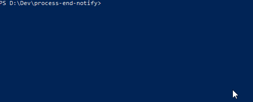

# process-end-notify

This tool is designed to notify you when a specific process is finished. The library has a command-line interface. It can be used just as a single CLI tool. Or use can choose an API approach and pass your callback which will be executed when a process finishes.

## Requirements

1. Node.js version 14^ installed.

## Usage
### CLI
1. Install the lib by running `npm install process-end-notify`.
2. Open a terminal window inside a folder with the installed lib.
3. From your terminal run `node cli.js`.

#### CLI demo


### API
1. Install the lib by running `npm install process-end-notify`.
2. Import the lib:
```js
const watcher = require('process-end-notify');
```
3. Attach callback function:
```js
watcher.watchUntilFinishes(() => {
    console.log('VAULA!');
});
```

Full example:
```js
const watcher = require('process-end-notify');

watcher.watchUntilFinishes(() => {
    console.log('VAULA!');
});
```